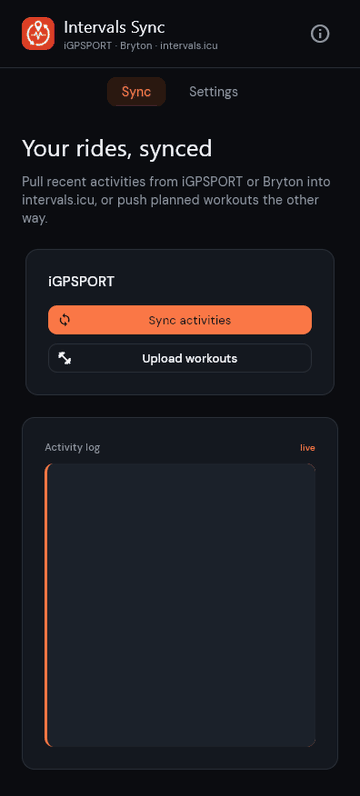
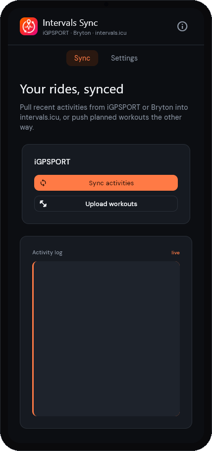
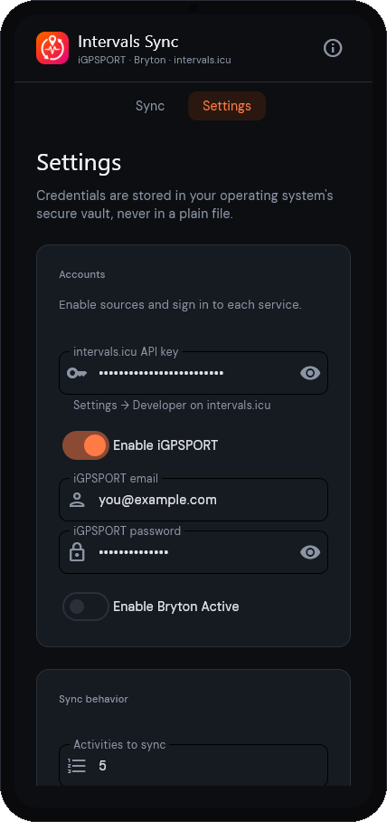

<p align="center">
  
</p>

<h1 align="center">Intervals Sync</h1>

<p align="center">
  <strong>The missing intervals.icu sync tool for iGPSPORT and Bryton users.</strong>
</p>

<p align="center">
  <a href="LICENSE"></a>
  <a href="https://github.com/jorge-huxley/intervalssync/releases"></a>
  <a href="https://github.com/jorge-huxley/intervalssync/releases"></a>
  <a href="https://github.com/jorge-huxley/intervalssync/stargazers"></a>

</p>

<p align="center">
  <a href="https://ko-fi.com/jorge_huxley"></a>
</p>

<p align="center">
  Enter your credentials once, press <strong>Sync</strong>, and your latest rides from
  <strong>iGPSPORT</strong> or <strong>Bryton Active</strong> land on <strong>intervals.icu</strong>. You can also push
  planned workouts from intervals.icu back to iGPSPORT or Bryton Active.
  Free and open source, for <strong>Windows</strong> and <strong>Android</strong>.
</p>

<p align="center">
  <a href="https://github.com/jorge-huxley/intervalssync/releases/latest">Download</a> &middot;
  <a href="docs/AGENT.md">CLI &amp; agents</a> &middot;
  <a href="CONTRIBUTING.md">Contributing</a>
</p>

---

<br>

<p align="center">
  
</p>

<details>
  <summary><b>More screenshots</b></summary>
  <br>
  <p align="center">
    
    &nbsp;&nbsp;
    
  </p>
</details>

## Features

- Syncs recent rides from **iGPSPORT** or **Bryton Active** to **intervals.icu** (original `.fit` files)
- **Optional Dropbox upload** — mirror activities to a Dropbox folder from the GUI (iGPSPORT or Bryton sync)
- **Upload workouts** — push planned cycling workouts from your intervals.icu calendar to iGPSPORT custom workouts or Bryton Active (sync to your head unit from the vendor app)
- **Skips activities already uploaded** so re-running is safe — with an optional *force re-sync*
- Lets you choose how many recent activities to process
- **Workout upload window** in Settings — how many calendar days to upload (default: today only)
- **Sets the intervals.icu sport type** after upload (e.g. Mountain Bike Ride / Gravel Ride) — iGPSPORT exports everything as a generic "Ride"
- Optionally deletes the local `.fit` files after a successful upload
- Stores your credentials in the **OS secure vault** (Windows Credential Manager / Android Keystore), never in a file
- Lets you know when a newer version is available
- **Headless CLI** — activity sync and workout upload from the terminal, with JSON output and exit codes for automation and AI agents (see [CLI & automation](#cli--automation-ai-agents))

> Prefer the terminal, or want to help out? It's open source (Python + [Flet](https://flet.dev), MIT) — see [CONTRIBUTING.md](CONTRIBUTING.md).

## Download & run (Windows)

1. Go to the [Releases](../../releases) page and download the latest `.zip`.
2. Unzip it anywhere and double-click the app (e.g. `intervalssync.exe`).
3. On first launch, open **Settings** and enter:
   - your iGPSPORT **email** and **password**
   - your intervals.icu **API key** (intervals.icu → Settings → Developer)
4. Click **Save**, then go back and press **Sync** (or **Upload to iGPSPORT** / **Upload to Bryton** for planned sessions on your intervals.icu calendar).

Your password and API key are stored in your operating system's **secure
credential store** — Windows Credential Manager on Windows (the same vault
Windows uses for its own logins) — never in a plain text file.

## Download & run (Android)

1. On the [Releases](../../releases) page, download the latest `.apk`.
2. Open it on your phone. Android will ask you to allow installing from this
   source — accept (Settings → "Install unknown apps" for your browser/files app).
3. Open the app, fill in **Settings** (same fields as above), then **Sync** or **Upload to iGPSPORT** / **Upload to Bryton**.

On Android your credentials are stored in the **Android Keystore**. The app
isn't on the Play Store, so the "unknown source" prompt is expected.

## CLI & automation (AI agents)

Headless `intervalssync` CLI — sync from iGPSPORT or Bryton, upload workouts to iGPSPORT or Bryton, JSON on stdout. See [Agent / headless sync](docs/AGENT.md).

## Run from source

Requires [uv](https://docs.astral.sh/uv/).

```bash
uv sync
cp .env.example .env    # optional: credentials for CLI; IGPSYNC_DROPBOX_APP_KEY for Dropbox
uv run --env-file .env intervalssync-gui
```

## Build the Windows executable

```bash
uv run flet build windows
```

The distributable lands in `build/windows/`. (Flet downloads the Flutter
toolchain on the first build.)

## Roadmap

The app is built with [Flet](https://flet.dev), so the same Python code targets
desktop and Android today, with **iOS** (`flet build ipa`) possible from the same
code.

## Support

Tips on [Ko-fi](https://ko-fi.com/jorge_huxley) help fund bug fixes, releases, and new features. Thank you!

## Acknowledgements

This project builds on community work around iGPSPORT activity access and
syncing:

- [kamikadzem22/igpsport-unoffical-api](https://github.com/kamikadzem22/igpsport-unoffical-api)
  for documenting and exploring the unofficial iGPSPORT API.
- [simple4wan/ride-sync](https://github.com/simple4wan/ride-sync) for prior
  work on syncing ride activities between services.

This app is an independent project and is not affiliated with iGPSPORT,
intervals.icu, or the projects listed above.
